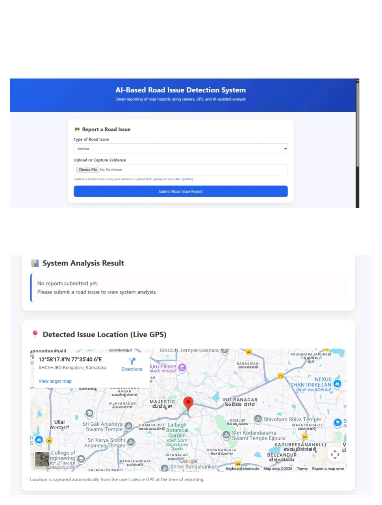
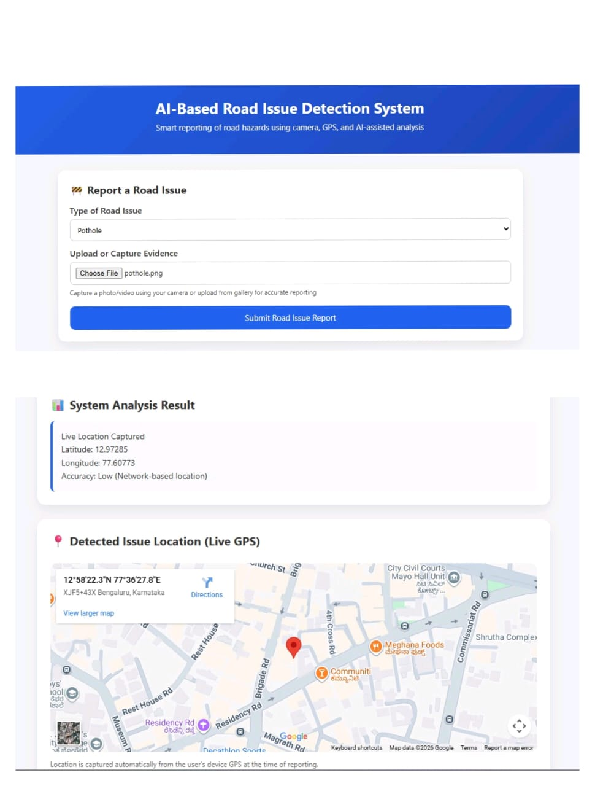

# AI-Based Road Issue Detection System 🚧🤖

An intelligent community-driven web application that allows users to report road issues such as potholes and broken streetlights using **live GPS location, camera input, and AI-assisted severity analysis**.

---

## 🚀 Features

- 📍 **Live GPS Location Capture**
- 📸 **Camera-based Photo & Video Upload**
- 🧠 **AI-powered Issue Detection & Severity Analysis**
- 🗺️ **Real-time Google Maps Location Preview**
- ⚡ **Fast & User-Friendly Interface**
- 🏙️ **Supports Smart City Infrastructure**

---

## 🛠️ Tech Stack

### Frontend
- HTML5
- CSS3
- JavaScript
- Browser Geolocation API
- Google Maps Embed (for location visualization)

### Backend
- Python
- Flask
- Flask-CORS

### Google Technologies Used
- **Google Maps Platform** – to visualize exact road issue locations on the map
- **Google Geolocation Services (via browser)** – to capture live GPS coordinates
- **Google Chrome APIs** – camera and location permissions on mobile devices


## ▶️ How to Run Locally

Follow these steps to run the prototype on your local machine:

### Prerequisites
- Python 3.x installed
- A modern web browser (Google Chrome recommended)
- Internet connection (for Google Maps)

### Backend Setup
```bash
cd backend
python app.py
```

---
### Frontend Setup
1. Open the `frontend` folder
2. Open `index.html` in a browser  
   (Google Chrome recommended)

### Usage
1. Allow **location** and **camera** permissions
2. Select issue type (Pothole / Broken Streetlight)
3. Capture or upload photo/video
4. View detected issue details and live location on Google Maps

> ⚠️ Note: This is a prototype intended for demonstration purposes.


## 📷 How It Works

1. User selects the type of road issue
2. Captures or uploads photo/video evidence
3. System fetches live GPS location
4. AI analyzes issue severity
5. Exact issue location is displayed on Google Maps
6. Data is sent to backend for processing

---

## 🌍 Use Case

- Smart city road monitoring
- Municipal corporation reporting
- Community-driven road safety
- Infrastructure maintenance prioritization

---

## 🔐 API Keys & Security

Google Maps API keys are required for map rendering.  
⚠️ **Do not expose API keys in production environments.**

---
## 👥 Team Members

- **Varun Reddy** – Full Stack Development, GPS & Camera Integration  
  GitHub: https://github.com/hvarun4262-dev

- **D ASISH KETHAN** – Backend Development & API Integration  

- **G CHETHAN SAI** – AI Logic, Problem Analysis & Documentation


---

## 📸 Screenshots

### Homepage/Before Reporting Issue


### After Reporting Issue



## ⭐ Future Enhancements

- AI model for real-time pothole detection
- User authentication
- Admin dashboard for authorities
- Issue status tracking
- Heatmap visualization of road issues
